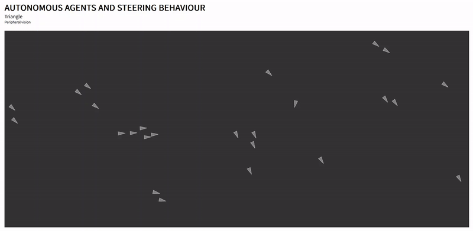

# Autonomous agents and steering behaviour
## Description
An application showcasing autonomous agents and steering behaviour in a simulated environment. The application is based on the [p5.js](https://p5js.org) library and uses [Browsersync](https://browsersync.io) for live reloading and static site serving.

<center>

</center>

## Prerequisites
* [Node.js](https://nodejs.org/en)
* [Browsersync](https://browsersync.io)
* [Docker](https://www.docker.com)

## Installation
To install the application, clone the repository and install Browsersync by executing the following command:

```bash
› npm install -g browser-sync
```

Alternatively, the application can be installed using Docker by executing the following command:
```bash
› docker compose build
```

## Launch
Execute the following command to launch the application:
```bash
› browser-sync start --server -f -w
```

Alternatively, the application can be launched using Docker by executing the following command:
```bash
› docker compose up
```

Application's user interface is available at [localhost:3000](http://localhost:3000).